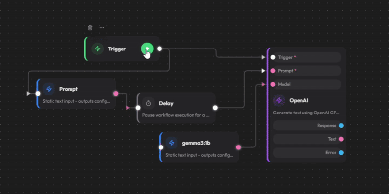

<p align="center">
  <picture>
    <source media="(prefers-color-scheme: dark)" srcset="media/logo_white_orange.svg">
    
  </picture>
  <span style="font-size: 36px; vertical-align: middle; margin-left: 8px;">y<span style="color: #E5A01F">node</span></span>
</p>

<div align="center"><b>———&nbsp;&nbsp;&nbsp;open-source visual workflow automation&nbsp;&nbsp;&nbsp;———</b></div>
<br />

<div align='center'>
  <a href="CONTRIBUTING.md" target="_blank">
    
  </a>
</div>

<div align='center'>
  
  
  
  
</div>
<br/>

> [!NOTE]
> ynode is **actively developed**. We welcome contributions, feedback, and feature requests!

## &nbsp;&nbsp;Key Features

-  **Visual Builder**: Intuitive node-based editor powered by React Flow.
-  **Extensible**: Add custom nodes easily via CLI scaffolding.
-  **Secure**: Built-in encryption for credentials + you own your data.
-  **Self-Hosted**: Deploy within your infrastructure with full autonomy.
-  **Monorepo**: Clean architecture using pnpm workspaces.
<br />
<div align="center"><b>———&nbsp;&nbsp;&nbsp;y<span style="color: #E5A01F">node</span> is designed to be the automation backbone for everyone!&nbsp;&nbsp;&nbsp;———</b></div>

## &nbsp;&nbsp;Demo

<div align='center'>
  </img>
</div>

## &nbsp;&nbsp;Project Structure

```
ynode/
│
├── 📦 packages/
│   ├── @ynode/core        # Shared types, node definitions, & serialization
│   └── ynode-cli          # Development tools (scaffolding & validation)
│
├── 🎨 ynode-app           # Frontend (React + Vite + React Flow)
└── ⚡ ynode-server        # Backend (Express + SQLite + WebSocket)
```


## &nbsp;&nbsp;Quick Start

#### PREREQUISITES

##### &nbsp;&nbsp;Requirements

- [Node.js](https://nodejs.org/) 18 or higher
- [pnpm](https://pnpm.io/) package manager

##

#### INSTALLATION

##### &nbsp;&nbsp;1. Clone the Repository

```bash
git clone https://github.com/iamyureka/ynode.git
cd ynode
```

##### &nbsp;&nbsp;2. Install Dependencies

```bash
pnpm install
```

##### &nbsp;&nbsp;3. Build Core Library

```bash
pnpm --filter @ynode/core build
```

##

#### DEVELOPMENT

##### &nbsp;&nbsp;Start Backend

```bash
pnpm --filter ynode-server dev
```

##### &nbsp;&nbsp;Start Frontend

```bash
pnpm --filter ynode-app dev
```

| Service | URL                   |
| ------- | --------------------- |
| **App** | http://localhost:5173 |
| **API** | http://localhost:3001 |

## &nbsp;&nbsp;Canvas Controls

| Action                                                                                         | Shortcut                    |
| ---------------------------------------------------------------------------------------------- | --------------------------- |
|  Multi-select nodes | `Left Drag` (selection box) |
|  Pan canvas        | `Right Drag`                |
|  Toggle selection     | `Ctrl + Click`              |
|  Create comment          | `C`                         |
|  Delete nodes              | `Delete` / `Backspace`      |
|  Copy / Paste / Duplicate   | `Ctrl + C` / `V` / `D`      |

## &nbsp;&nbsp;Custom Nodes

Create custom nodes using the CLI for seamless integration with your workflows.

```bash
# Scaffold a new node
pnpm --filter ynode-cli create my-custom-node
```

> [!TIP]
>
> For detailed instructions, see the [CLI Documentation](packages/ynode-cli/README.md).

## &nbsp;&nbsp;Documentation

| Package                                      | Description                                     |
| -------------------------------------------- | ----------------------------------------------- |
| [@ynode/core](packages/ynode-core/README.md) | Shared types, node definitions, & serialization |
| [ynode-cli](packages/ynode-cli/README.md)    | CLI tools for scaffolding custom nodes          |

## &nbsp;&nbsp;Contributing

Interested in contributing to ynode?<br> Check out our [Contributing Guide](CONTRIBUTING.md) for instructions on getting started

## &nbsp;&nbsp;Support

If ynode helps your workflow, consider supporting its development:

<a href="https://paypal.me/bangmey" target="_blank">
  
</a>

## &nbsp;&nbsp;License

This project is licensed under the [AGPL-3.0 License](LICENSE).

---